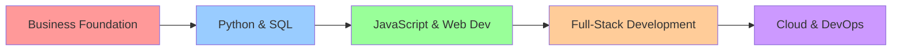

# Hi there! 👋 I'm John!

<div align="center">
  
  [](https://git.io/typing-svg)
  
  
  
  
</div>

---

## 🚀 About Me

I'm a **business graduate** 💼 with a passion for coding 💻 and building tools 🛠️ to solve real-world problems.

```javascript
const profile = {
    background: "Business Graduate",
    passion: "Coding & Problem Solving",
    mission: "Bridge business strategy with technical implementation",
    focus: "Practical tools for data-driven decisions",
    status: "Building portfolio & transitioning to tech",
    motto: "Technology should serve business goals"
};
```

**What drives me:**
* 🎯 Love bridging the gap between business strategy and technical implementation
* 📊 Focus on creating practical tools that streamline workflows and drive data-driven decisions
* 💡 Goal to continuously learn and build innovative solutions
* 🤝 Passionate about how technology can drive business success

---

## 🛠️ Tech Arsenal

<div align="center">

### Core Technologies
[](https://www.python.org/)
[](https://developer.mozilla.org/en-US/docs/Web/JavaScript)
[](https://www.postgresql.org/)

### Expanding Into


### Tools & Platforms


</div>

---

## 📊 GitHub Analytics

<div align="center">
  
  
</div>

<div align="center">
  
</div>

---

## 🏆 GitHub Trophies

<div align="center">
  
</div>

---

## 📈 Contribution Graph

<div align="center">
  
</div>

---

## 🚀 Featured Projects

<div align="center">

### Business-Focused Solutions 💼

</div>

<!-- PROJECT 1 -->
<details>
<summary><b>🎯 [Project Name 1] - Business Problem Solver</b></summary>

[](https://github.com/YOUR-USERNAME/REPO-NAME)

**🔥 What it does:**
- Brief description of the project and its purpose
- Highlights the business problem it solves 🎯
- Impact: [Specific metrics or improvements achieved]

**🛠️ Built with:** `Python` `SQL` `[Other Technologies]`

**📊 Business Impact:**
- Improved efficiency by X%
- Reduced processing time from X to Y
- Enabled data-driven decision making

[🔗 Live Demo](DEMO-LINK) | [📖 Detailed Documentation](REPO-LINK)

</details>

<!-- PROJECT 2 -->
<details>
<summary><b>📈 [Project Name 2] - Data-Driven Insights</b></summary>

[](https://github.com/YOUR-USERNAME/REPO-NAME)

**🔥 What it does:**
- Another project description, focusing on its business impact
- Explains how it improved efficiency or provided valuable insights 📊
- Key features and user benefits

**🛠️ Built with:** `JavaScript` `SQL` `[Other Technologies]`

**📊 Key Achievements:**
- Automated manual processes
- Generated actionable business insights
- Improved stakeholder decision-making

[🔗 Live Demo](DEMO-LINK) | [📖 Detailed Documentation](REPO-LINK)

</details>

<!-- Add more projects as needed -->

---

## 📚 Current Learning Journey

<div align="center">



</div>

**🎯 Currently Focused On:**
- Advanced JavaScript & React development
- Building full-stack applications
- Cloud deployment and DevOps practices
- Open source contributions

**📖 Learning Resources:**
- Building projects to reinforce concepts
- Contributing to open source projects
- Engaging with the developer community

---

## 🌐 Connect & Collaborate

<div align="center">

[](YOUR-LINKEDIN-URL)
[](mailto:YOUR-EMAIL)
[](YOUR-PORTFOLIO-URL)
[](YOUR-TWITTER-URL)

</div>

---

<div align="center">

### 💬 Let's Connect!

*"Combining business insight with technical innovation to build solutions that matter"*

**🤝 Open to opportunities in:**
- Junior Developer roles
- Business Analyst positions with technical focus
- Collaborative projects bridging business and tech
- Mentorship and learning opportunities

---

⭐ **If you find my work interesting, consider giving my repositories a star!** ⭐


</div>
